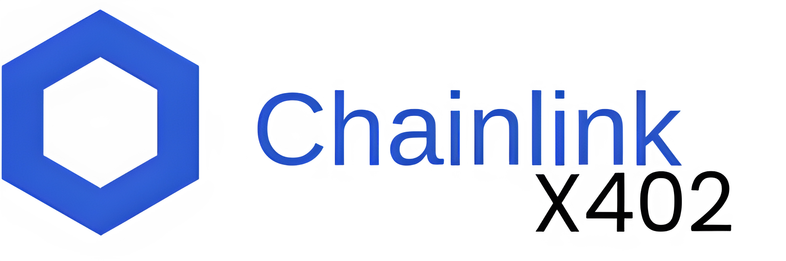
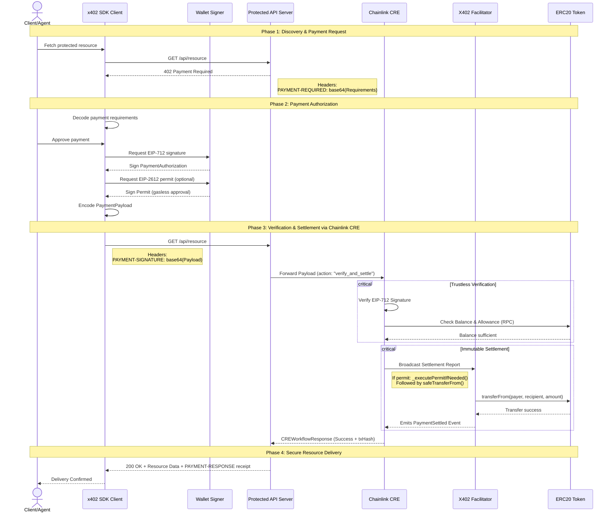

<div style="text-align:center" align="center">
    <a href="https://chain.link" target="_blank">
        
    </a>


[](https://www.apache.org/licenses/LICENSE-2.0)
[](https://docs.chain.link/cre)

[](https://startup-dreamer.github.io/x402-chainlink/)

</div>

<center style="font-size: 20px; font-weight: bold;">
<p>

_**Empowering the next generation of the decentralized web with seamless, borderless micro-monetization.**_

</p>
</center>

## Preface

Monetizing Web3 APIs today means either building a centralized database to track user deposits, or forcing users to sign clunky, expensive transactions for every API call.


**x402-Chainlink** solves this. Instead of a centralized processor acting as the middleman, we use **Chainlink CRE** as a verifiable, decentralized backend. The x402 protocol handles the HTTP-level negotiation, allowing servers to demand payment and clients to automatically fulfill it via smart contracts, returning a cryptographically secure token (like a [Macaroon](https://research.google/pubs/pub41892/)) to access the resource.


- [sdk-docs](https://startup-dreamer.github.io/x402-chainlink/)
- [npm-package](https://www.npmjs.com/package/x402-chainlink)

# x402-chainlink

## Overview

x402-chainlink is a self-sovereign payment SDK that acts as the "**Stripe for Web3.**" It enables developers to seamlessly monetize APIs, digital resources, and **AI agent** workflows using standard HTTP 402 (Payment Required) protocols, entirely secured by the Chainlink Runtime Environment (CRE).

Unlike centralized payment processors or clunky escrow contracts, x402 allows users to maintain absolute custody of their funds. Buyers simply sign an off-chain intent to pay, and the Chainlink Decentralized Oracle Network (DON) handles the rest—verifying balances and executing trustless, atomic settlements on-chain.


**Key Features**

* **Machine-to-Machine (M2M) Payments:** Designed natively for the agentic economy. AI agents and headless clients can seamlessly intercept 402 responses, request cryptographic signatures, and pay for the resources they consume autonomously.
* **Universal API & dApp Gating:** Standardized HTTP headers (`PAYMENT-REQUIRED`, `PAYMENT-SIGNATURE`) provide a drop-in solution to gate premium API endpoints, exclusive dApp features, or digital downloads without building complex, centralized paywalls.
* **Extensible Architecture (Custom Modules):** The SDK ships with a built-in `ExtensionRegistry` featuring strict JSON schema validation. Developers can easily extend the base protocol to build custom Web3 billing models like **metered usage**, **recurring subscriptions**, **tipping**, or receipt generation.
* **True Self-Sovereignty (EIP-712):** No centralized deposits or hot wallets. Users hold their keys and authorize payments via secure, off-chain cryptographic signatures.
* **Gasless User Experience (EIP-2612):** Built-in support for token permits eliminates the friction of separate, expensive "Approve" and "Transfer" transactions. Users experience a one-click checkout.
* **Unstoppable Settlement:** Chainlink DONs provide Byzantine Fault Tolerant (BFT) consensus to verify signatures and settle the final token transfers trustlessly via the `X402Facilitator` smart contract.

### Key Use Cases

1. **API Monetization (Machine-to-Machine):** Charge per API call without requiring users to buy subscriptions. Perfect for AI models, oracle data feeds, or heavy compute tasks.
2. **Decentralized Paywalls:** Monetize premium content, articles, or digital media natively via user wallets.
3. **Frictionless Token-Gating:** Verify NFT or token holdings directly at the HTTP layer before serving content.
4. **Automated Micro-transactions:** Enable streaming payments for continuous services (e.g., video streaming, cloud storage).

---

## Architecture & Protocol Flow

The SDK abstracts the entire x402 negotiation and on-chain settlement process. Under the hood, Chainlink CRE acts as the secure, decentralized verifier that confirms the payment on-chain and signs the authorization token.

### The x402 Negotiation Sequence



---

## SDK Usage

We built this SDK to be as intuitive as Web2 payment gateways. You don't need to be a blockchain expert to use it you can refer to the intuitive [SDK Documentation](https://startup-dreamer.github.io/x402-chainlink/) for more details.

### 1. The Agentic Use Case (server-side)

Perfect for headless AI agents or scripts that need to autonomously pay for premium API resources using a funded wallet.

```typescript
import { createWalletClient, createPublicClient, http } from 'viem';
import { privateKeyToAccount } from 'viem/accounts';
import { baseSepolia } from 'viem/chains';
import { 
  decodePaymentRequired, 
  selectPaymentRequirements, 
  createPaymentPayloadWithPermit, 
  encodePaymentSignature, 
  HTTP_HEADERS 
} from 'x402-chainlink';

// 1. Initialize the Agent's Viem Wallet
const account = privateKeyToAccount('0xAGENT_PRIVATE_KEY');
const walletClient = createWalletClient({ account, chain: baseSepolia, transport: http() });
const publicClient = createPublicClient({ chain: baseSepolia, transport: http() });

async function fetchPremiumData(url: string) {
  // 2. Make standard request, intercept the 402 Paywall
  let response = await fetch(url);
  
  if (response.status === 402) {
    // 3. Decode server requirements and auto-select affordable option across chains
    const required = decodePaymentRequired(response.headers.get(HTTP_HEADERS.PAYMENT_REQUIRED)!);
    const requirement = await selectPaymentRequirements(required.accepts, publicClient, account.address, 'eip155:84532');

    // 4. Agent autonomously signs EIP-712 Intent & EIP-2612 Gasless Permit
    const payload = await createPaymentPayloadWithPermit(
      walletClient,
      publicClient,
      2, // x402 version
      requirement,
      { endpoint: 'https://cre.chainlink.example.com', network: 'eip155:84532' },
      { includePermit: true } 
    );

    // 5. Retry request with cryptographic signature
    response = await fetch(url, {
      headers: {
        [HTTP_HEADERS.PAYMENT_SIGNATURE]: encodePaymentSignature(payload)
      }
    });
  }

  return response.json(); // Returns unlocked premium data!
}
```

### 2. The Client Use Case

Perfect for frontend applications. This provides a "Stripe-like" one-click checkout experience by utilizing EIP-2612 permits, meaning the user doesn't have to pay gas just to approve tokens.

```typescript
import { useWalletClient, usePublicClient, useAccount } from 'wagmi';
import { 
  decodePaymentRequired, 
  createPaymentPayloadWithPermit, 
  encodePaymentSignature, 
  HTTP_HEADERS 
} from 'x402-chainlink';

export function PremiumArticle({ articleId }) {
  const { data: walletClient } = useWalletClient();
  const publicClient = usePublicClient();
  const { address } = useAccount();

  const unlockArticle = async () => {
    if (!walletClient || !address) return alert("Please connect wallet");

    // 1. Attempt to fetch premium content
    const res = await fetch(`/api/articles/${articleId}`);
    
    if (res.status === 402) {
      const required = decodePaymentRequired(res.headers.get(HTTP_HEADERS.PAYMENT_REQUIRED)!);
      const requirement = required.accepts[0];

      // 2. Prompt MetaMask to sign intent & permit (One-click, gasless UX)
      const payload = await createPaymentPayloadWithPermit(
        walletClient,
        publicClient,
        2,
        requirement,
        { endpoint: 'https://cre.chainlink.example.com', network: 'eip155:8453' },
        { includePermit: true }
      );

      // 3. Fetch premium content with user's signature
      const premiumRes = await fetch(`/api/articles/${articleId}`, {
        headers: {
          [HTTP_HEADERS.PAYMENT_SIGNATURE]: encodePaymentSignature(payload)
        }
      });
      
      const article = await premiumRes.json();
      console.log("Unlocked Article:", article);
    }
  };

  return <button onClick={unlockArticle}>Unlock for 1 USDC</button>;
}

```

<!-- Perfect for headless AI agents or scripts that need to autonomously pay for premium API resources using a funded hot wallet. -->

---

## Why Chainlink CRE?

The core innovation of this project lies in moving the heavy lifting of payment verification off the primary application server and into the **Chainlink Runtime Environment**.

* **Absolute Trust:** The server doesn't need to trust the client, and the client doesn't need to trust the server. The CRE acts as the decentralized, unbiased referee that verifies the on-chain settlement and issues the access credential.
* **Chain Agnosticism:** Because CRE can observe multiple networks, your API can accept payments on Polygon, Base, Ethereum, or Arbitrum simultaneously without you having to run local RPC nodes for each.
* **Low Latency:** CRE workflows execute securely and rapidly off-chain, ensuring the HTTP request-response cycle remains fast enough for modern web applications.

## Running SDK Examples Locally

### Prerequisites
- Node.js v18.0.0 or higher
- npm or bun package manager
- Chainlink CRE CLI (For simulation we sould spwan a cre client in simulation mode and run the workflow locally)

1. **Clone & Install:**
```bash
git clone https://github.com/your-org/x402-chainlink.git
cd x402-chainlink
```


2. **Set Up the Backend Server (Examples/backend):**
```bash
# Navigate to backend example
cd examples/backend

# Install backend dependencies
npm install

# Create environment file
cp .env.local .env.local  # Already exists, but you may want to customize

# Edit .env.local with your values
nano .env.local

# Run the backend server
npm run dev
```


4. **Set Up the AI Agent Client (Examples/app):**
```bash
# Navigate to agent example (from repo root)
cd examples/agent

# Install agent dependencies
npm install

# Create environment file
cp .env.example .env

# Edit .env with your values
nano .env

# Run the agent client
npm start
```
Note: You need to have funded wallet to run the agent client.

5. **Set Up the Frontend Client (Examples/app):**
```bash
# Navigate to frontend example (from repo root)
cd examples/app

# Install frontend dependencies
npm install

# Create environment file
cp .env.local.example .env.local

# Edit .env.local with your values
nano .env.local

# Run the frontend client
npm run dev
```

<!-- ### AI agent workflow example: -->


## Contributing & Next Steps

This project is open-source and actively seeking contributions. Future roadmap items include:

* Making the production deployment of the SDK with Chainlink CRE.
* Subscription/recurring payment models using Chainlink Automation.
* Native browser extension for background x402 automated settlements.
* Native integration with LangChain and AutoGPT.

---
## Contact
Twitter - [@Krieger](https://twitter.com/Startup_dmr)  
Mail - prsumit35@gmail.com

## Acknowledgment

Thanks to [Chainlink](https://chain.link/) for providing the innovative and user-friendly framework and development guide for chainlink runtime environment and organizing the [**Convergence Hackathon**](https://chain.link/hackathon) that inspired me to create x402-chainlink. I would greatly appreciate any feedback or guidance from the judges.


### References

- Chainlink Runtime Environment: [Runtime Environment](https://docs.chain.link/cre)
- x402 Protocol: [Protocol](http://blog.cloudflare.com/x402/)
- EIP-712: [EIP-712](https://eips.ethereum.org/EIPS/eip-712)
- EIP-2612: [EIP-2612](https://eips.ethereum.org/EIPS/eip-2612)
