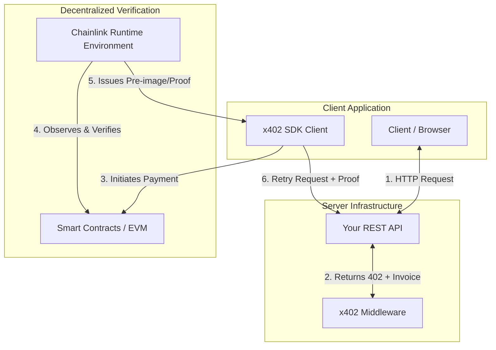
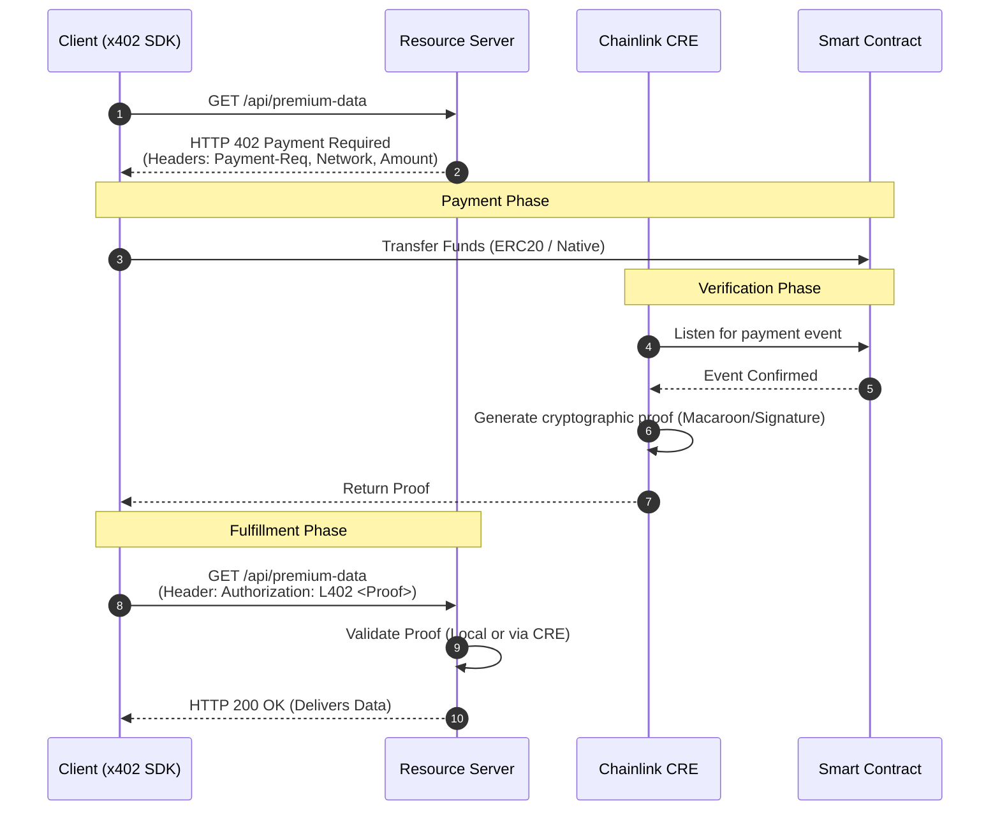

<div style="text-align:center" align="center">
    <a href="https://chain.link" target="_blank">
        
    </a>


[](https://www.apache.org/licenses/LICENSE-2.0)
[](https://docs.chain.link/cre)

</div>

# x402-chainlink

## Overview

Push Engine is a service that bridges off-chain data streams with on-chain smart contracts. It continuously monitors off-chain price updates and pushes them on-chain based on predefined conditions such as price deviations or time intervals.

### Key Features:

- Retrieves and verifies price data from Chainlink Data Streams.
- Writes verified prices to on-chain smart contracts.
- Supports containerized deployment with Docker.
- Configurable through environment variables and Redis-based settings.

---

## Table of contents

- [Push Engine](#push-engine)
  - [Overview](#overview)
    - [Key Features:](#key-features)
  - [Table of contents](#table-of-contents)
  - [System Architecture Overview](#system-architecture-overview)
  - [Installation Instructions](#installation-instructions)
    - [Prerequisites](#prerequisites)
    - [Installation Steps](#installation-steps)
  - [Environment Variables](#environment-variables)
  - [YAML Configuration Setup](#yaml-configuration-setup)
    - [YAML Configuration](#yaml-configuration)
    - [Example YAML Configuration](#example-yaml-configuration)
    - [Key Configuration Parameters](#key-configuration-parameters)
  - [Deployment Guide](#deployment-guide)
    - [Running with Docker Compose](#running-with-docker-compose)
    - [Production Deployment](#production-deployment)
  - [WebSocket Reconnect Logic](#websocket-reconnect-logic)
    - [How it works](#how-it-works)
    - [When Reconnect Happens](#when-reconnect-happens)
    - [Reconnect Configuration](#reconnect-configuration)
    - [Retry Logic](#retry-logic)
  - [Infrastructural Considerations](#infrastructural-considerations)
  - [UI](#ui)
    - [UI Setup Instructions](#ui-setup-instructions)
    - [UI usage](#ui-usage)
      - [Streams](#streams)
        - [Contract](#contract)
          - [EVM Contract](#evm-contract)
          - [SVM Program](#svm-program)
        - [Add new data stream](#add-new-data-stream)
      - [Chain](#chain)
        - [Switch chain](#switch-chain)
        - [Add new chain](#add-new-chain)
      - [Schedule](#schedule)
        - [Set new schedule pattern](#set-new-schedule-pattern)
      - [Verifier Contracts](#verifier-contracts)
        - [Set Verifier Contracts](#set-verifier-contracts)
      - [Price delta percentage](#price-delta-percentage)
      - [Gas cap](#gas-cap)
      - [Logs](#logs)
  - [Logging](#logging)
  - [Testing Commands](#testing-commands)
  - [Notes](#notes)
  - [Troubleshooting](#troubleshooting)
    - [Common Issues \& Fixes](#common-issues--fixes)
  - [Modifications \& Further Development](#modifications--further-development)
    - [Modifications](#modifications)
  - [Styling](#styling)
  - [License](#license)
  - [Resources](#resources)
# 🌐 x402-Chainlink SDK: The Web3 Stripe Powered by CRE

x402-Chainlink is a robust, developer-friendly SDK that brings a "Stripe-like" seamless payment experience to Web3. By leveraging the **x402 Protocol** (an evolution of the HTTP 402 Payment Required standard) and the **Chainlink Runtime Environment (CRE)**, this project enables developers to instantly monetize APIs, content, and services with decentralized, chain-agnostic micro-payments.

If you can use a standard REST API, you can now monetize it with crypto in less than 10 lines of code.

---

## 💡 The Vision: Decentralizing the Payment Processor

Centralized payment processors like Stripe revolutionized Web2 by abstracting away the complexity of fiat banking. However, Web3 payments remain fragmented, requiring users to sign complex transactions, manage multiple wallets, and deal with network-specific RPCs just to access a simple paid API or premium article.

**x402-Chainlink solves this.** Instead of a centralized processor acting as the middleman, we use **Chainlink CRE** as a verifiable, decentralized backend. The x402 protocol handles the HTTP-level negotiation, allowing servers to demand payment and clients to automatically fulfill it via smart contracts, returning a cryptographically secure token (like a Macaroon) to access the resource.

### 🎯 Key Use Cases

1. **API Monetization (Machine-to-Machine):** Charge per API call without requiring users to buy subscriptions. Perfect for AI models, oracle data feeds, or heavy compute tasks.
2. **Decentralized Paywalls:** Monetize premium content, articles, or digital media natively via user wallets.
3. **Frictionless Token-Gating:** Verify NFT or token holdings directly at the HTTP layer before serving content.
4. **Automated Micro-transactions:** Enable streaming payments for continuous services (e.g., video streaming, cloud storage).

---

## 🏗️ Architecture & Protocol Flow

The SDK abstracts the entire x402 negotiation and on-chain settlement process. Under the hood, Chainlink CRE acts as the secure, decentralized verifier that confirms the payment on-chain and signs the authorization token.

### System Architecture



### The x402 Negotiation Sequence



---

## 🚀 Built for the Masses: SDK Usage

We built this SDK to be as intuitive as Web2 payment gateways. You don't need to be a blockchain expert to use it.

### 1. Server-Side: Protecting an Endpoint

Wrap your existing Express, Next.js, or standard Node.js endpoints with our middleware.

```typescript
import express from 'express';
import { x402Middleware } from 'x402-chainlink/server';

const app = express();

// Initialize the middleware with your Chainlink CRE config
const requirePayment = x402Middleware({
  creEndpoint: process.env.CRE_ENDPOINT,
  acceptedTokens: ['USDC', 'LINK'],
  price: 0.50, // USD
  network: 'any-evm' // Chain-agnostic via Chainlink CCIP/CRE
});

// Protect the route
app.get('/api/generate-ai-image', requirePayment, (req, res) => {
  res.json({ image: "https://...", message: "Payment successful via CRE!" });
});

app.listen(3000);

```

### 2. Client-Side: Consuming a Paid Endpoint

The client SDK intercepts `402 Payment Required` responses, automatically prompts the user's wallet for payment, retrieves the proof from the Chainlink CRE, and retries the request seamlessly.

```typescript
import { X402Client } from 'x402-chainlink/client';

// Initialize the client (hooks into Ethers.js, Viem, or Solana Web3)
const client = new X402Client({
  provider: window.ethereum, 
  autoPay: true, // Automatically handle micro-transactions below a certain threshold
  maxAutoPayThreshold: 5.00 
});

async function fetchPremiumData() {
  try {
    // The client handles the entire 402 negotiation under the hood
    const response = await client.fetch('https://api.yoursite.com/api/generate-ai-image');
    const data = await response.json();
    console.log(data);
  } catch (error) {
    console.error("Payment failed or request aborted", error);
  }
}

```

---

## 🛠️ Why Chainlink CRE?

The core innovation of this project lies in moving the heavy lifting of payment verification off the primary application server and into the **Chainlink Runtime Environment**.

* **Absolute Trust:** The server doesn't need to trust the client, and the client doesn't need to trust the server. The CRE acts as the decentralized, unbiased referee that verifies the on-chain settlement and issues the access credential.
* **Chain Agnosticism:** Because CRE can observe multiple networks, your API can accept payments on Polygon, Base, Ethereum, or Arbitrum simultaneously without you having to run local RPC nodes for each.
* **Low Latency:** CRE workflows execute securely and rapidly off-chain, ensuring the HTTP request-response cycle remains fast enough for modern web applications.

## 🏁 Running Locally

1. **Clone & Install:**
```bash
git clone https://github.com/your-org/x402-chainlink.git
cd x402-chainlink
npm install

```


2. **Configure Environment:**
Copy `.env.example` to `.env` and add your Chainlink CRE credentials and target RPC URLs.
3. **Deploy the Verifier Contract:**
```bash
npm run deploy:contracts

```


4. **Run the Example App:**
```bash
npm run dev:example

```


## 🤝 Contributing & Next Steps

This project is open-source and actively seeking contributions. Future roadmap items include:

* Full native Solana program integration.
* Subscription/recurring payment models using Chainlink Automation.
* Native browser extension for background x402 automated settlements.

---

*Empowering the next generation of the decentralized web with seamless, borderless micro-monetization.*